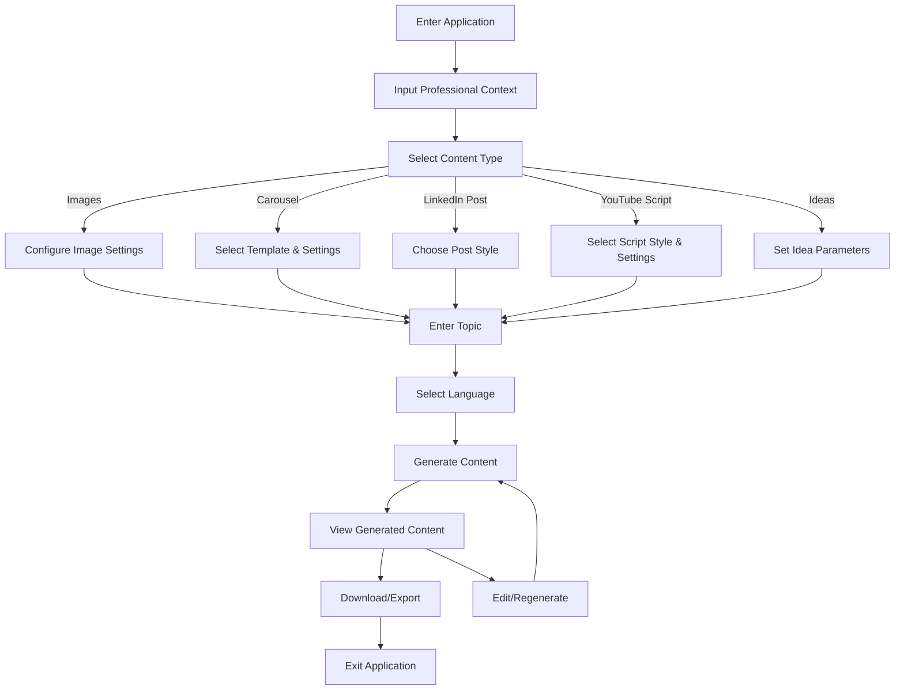
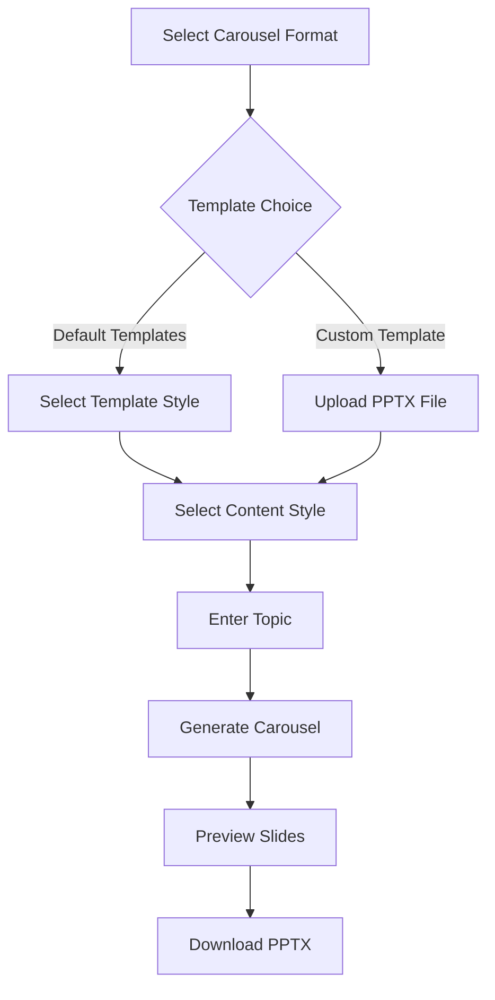
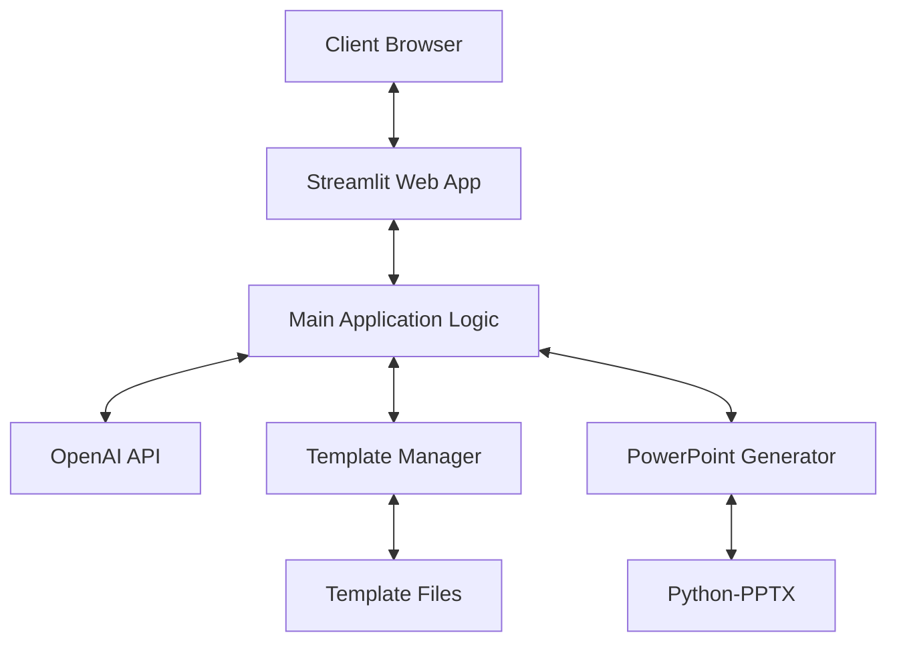
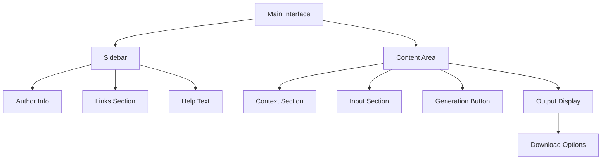
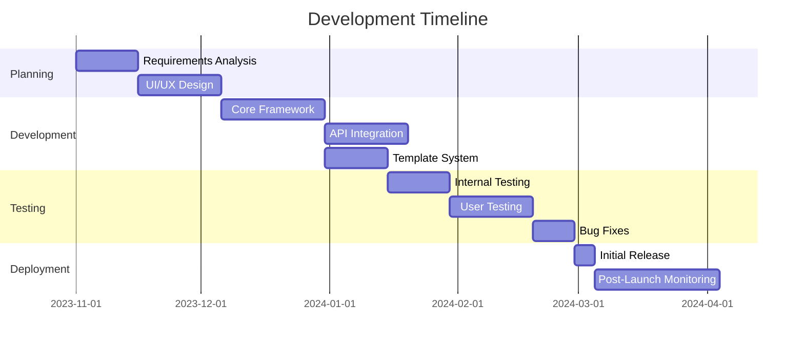

# VAM Content Generator - Product Requirements Document (PRD)

## 1. Introduction

### 1.1 Purpose
This Product Requirements Document (PRD) outlines the requirements, features, and specifications for the VAM Content Generator, an AI-powered tool for automating content creation across multiple formats.

### 1.2 Product Overview
VAM Content Generator is a Streamlit-based web application that leverages OpenAI's API to transform simple topic inputs into professionally formatted content outputs, including LinkedIn posts, carousel presentations, images, YouTube scripts, and content ideas.

### 1.3 Scope
The application addresses the need for quick, high-quality content generation for professionals, marketers, and content creators who need to maintain a consistent online presence across multiple platforms.

## 2. Target Audience

### 2.1 User Personas

1. **Professional Content Creator**
   - Needs to generate content regularly
   - Requires consistent quality and style
   - Values time savings and efficiency

2. **Digital Marketer**
   - Creates content for multiple clients/brands
   - Needs variety in content formats
   - Requires professional-looking presentations

3. **Professional/Executive**
   - Maintains personal brand on LinkedIn
   - Limited time for content creation
   - Needs high-quality, professional content

### 2.2 User Requirements

- Easy-to-use interface with minimal learning curve
- Fast content generation (under 2 minutes per piece)
- Professional-quality outputs with minimal editing needed
- Ability to customize content based on professional context
- Support for both English and Spanish languages

## 3. Product Features

### 3.1 Core Features

#### 3.1.1 Image Generation
- Generate professional images related to a given topic
- Provide AI-generated captions for each image
- Allow downloading of generated images

#### 3.1.2 LinkedIn Carousel Creation
- Generate complete PowerPoint presentations
- Support for multiple slide templates (blue, green, orange)
- Language options (English and Spanish)
- Customizable content styles (bullet points, paragraphs, mixed)
- Upload custom templates option

#### 3.1.3 LinkedIn Post Generation
- Generate professional LinkedIn posts
- Default and custom post styles
- Inclusion of relevant hashtags

#### 3.1.4 YouTube Script Generation
- Create full video scripts on any topic
- Multiple style options (Mr. Beast, Alex Hormozi, etc.)
- Customizable video length and section count
- Domain-specific options (Medical, Legal, Financial, Tech)

#### 3.1.5 Content Ideas Generation
- Generate list of content ideas related to a topic
- Provide title, description, and target audience for each idea

### 3.2 Contextual Features

#### 3.2.1 Professional Context Setting
- Input professional experience for contextual relevance
- Define interests to guide content focus
- Specify target audience for appropriate tone/style

#### 3.2.2 Language Selection
- Full support for English content
- Full support for Spanish (Neutral) content

## 4. User Flows

### 4.1 Main Content Generation Flow

### 4.2 Carousel Generation Flow

## 5. Technical Requirements

### 5.1 System Architecture

### 5.2 Dependencies

- **Streamlit**: Web application framework
- **OpenAI API**: AI content generation
- **Python-PPTX**: PowerPoint file manipulation
- **Python-dotenv**: Environment variable management
- **Requests**: HTTP interactions with OpenAI API

### 5.3 API Requirements

- OpenAI API access with appropriate rate limits
- Minimum model requirement: GPT-4 or equivalent for high-quality outputs
- DALL-E access for image generation

## 6. UI/UX Specifications

### 6.1 User Interface Layout

### 6.2 Design Requirements

- Clean, professional interface
- Responsive design for desktop and tablet
- Visual separation of input and output sections
- Clear status indicators during content generation
- Accessible color scheme and font choices

## 7. Performance Requirements

### 7.1 Speed & Efficiency
- Page load time: < 3 seconds
- Content generation time: < 60 seconds for text, < 90 seconds for images
- Carousel generation: < 120 seconds for 6-slide presentation

### 7.2 Reliability
- Application uptime: 99.5%
- Error handling for API failures with user-friendly messages
- Graceful degradation if specific features are unavailable

## 8. Security Requirements

### 8.1 Data Protection
- No user data storage beyond session
- Secure API key handling through environment variables
- No collection of generated content for training purposes

### 8.2 Access Control
- Local deployment option for sensitive content creation
- No user account requirement to protect privacy

## 9. Constraints & Limitations

### 9.1 Technical Constraints
- OpenAI API rate limits and costs
- Streamlit performance limitations
- PowerPoint template compatibility requirements

### 9.2 Business Constraints
- API usage costs that scale with generation volume
- Copyright considerations for generated content
- Limitations on commercial use based on OpenAI terms

## 10. Future Enhancements

### 10.1 Planned Features
- Twitter/X post generation
- Email content generation
- Blog post creation
- Content calendar integration
- Multi-user support with saved preferences
- Content history and favorites system

### 10.2 Expansion Areas
- Additional language support
- Integration with social media posting APIs
- Custom training for company/brand voice
- Subscription-based access tiers

## 11. Success Metrics

### 11.1 User Engagement
- Average session duration: >5 minutes
- Content pieces generated per session: >2
- Return user rate: >40%

### 11.2 Output Quality
- User satisfaction rating: >4.5/5
- Content edit rate: <30% of generated outputs requiring edits
- Download completion rate: >60% of generated content

## Appendix

### A. Development Timeline

### B. Test Cases

1. **Basic Content Generation**
   - Verify content generation for each format type
   - Test both languages for output quality
   - Ensure download/export functionality works

2. **Template Management**
   - Test default template loading
   - Verify custom template upload
   - Check compatibility with different PowerPoint versions

3. **Error Handling**
   - Test behavior with API failure
   - Verify graceful handling of invalid inputs
   - Check timeout handling for long-running generations

4. **Performance Testing**
   - Measure generation time for different content types
   - Test under different network conditions
   - Verify memory usage during extended sessions
